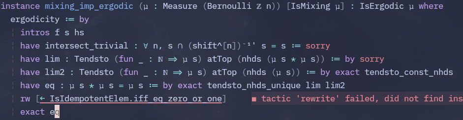

# Bowen

Formalisation du théorème d'existence et d'unicité des mesures de Gibbs pour des potentiels holderiens.
La preuve de ce théorème est dûe à R. Bowen.

## Accès

Blueprint : https://daurrian.github.io/bowen/blueprint/index.html

## TODO

Completer la structure du code lean pour pouvoir écrire la preuve du théorème sans les preuves des lemmes intermédiaires.

## Problemes

- Fonctionne pour résoudre l'équation x^2 = x avec x réel mais ne fonctionne pas ici et l'erreur aide pas.

- RPF1 : Schauder-Tychonoff nécessite d'avoir un espace vectoriel mais un ensemble de mesures n'est
pas un espace vectoriel.
